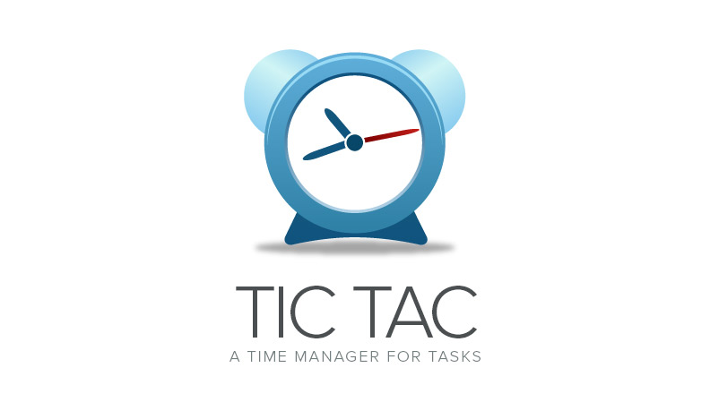

## What is Tic Tac? [](http://badge.fury.io/js/tictac) [](http://badge.fury.io/gh/vitorbritto%2Ftictac)

[](https://nodei.co/npm/tictac/)

_Tic Tac_ is a time manager for tasks and also the name given for a method that I use to manage the time in my work environment.

This method has some similarities with the Pomodoro technique considering how time is managed to increase mental alertness.

The intervals follow the same pattern adopted in Pomodoro, where we have 3 short intervals (3-5 minutes) and a long interval (15-30 minutes). The difference is that the duration for the task is up to the user. This facilitates the user to recognize how it behaves for that particular task, but also along with their perception and deduction of how long it takes to complete a given task. Thus, the user can maintain a priority leveling more flexibly and can identify strengths and weaknesses in their productivity.

Be aware that these techniques (Tic Tac and Pomodoro), does not refer to the act of accelerating the development of their tasks, but as a process of effort to stay focused on the task and avoid distractions.


> Note: tested on **Mac OSX** and **Ubuntu**.


## Install

First of all, make sure you have [Node.js](http://nodejs.org/) installed.

```bash
$ [sudo] npm install tictac -g
```

**Note:** for Linux/Ubuntu you must have/install [mpg123](https://github.com/dominictarr/mpg123).

```bash
$ [sudo] apt-get install mpg123
```

## Usage

```bash
$ tictac
$ task: [enter task name]
$ time: [enter time (in minutes)]
```

**Help:** use `tictac --help` or `tictac -h` for more details.

### Example

```
$ tictac
$ task: Reply Emails
$ time: 25
```

## Features

### Logger
Create a log file for each task inside `.tictac` directory in your user path.

### Notify
You can receive notifications when the task finishes.

**Requirements**

To use Grolw notifications, you need to install [node-growl](https://github.com/visionmedia/node-growl#installation).

**Usage**

```
$ tictac -g
```

### History
Show log history for previous tasks executed in tictac.

## Contribute
Feel free to [contribute](https://github.com/vitorbritto/tictac/pulls) with this project or leave a [suggestion](https://github.com/vitorbritto/tictac/issues).


## License

[MIT License](http://vitorbritto.mit-license.org/) © Vitor Britto
